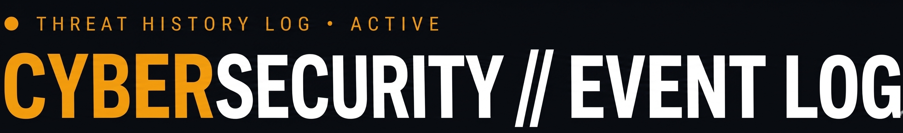

# 📜 Cybersecurity History // Event Log


<p align="center">
  
  
  
  
</p>

---

## Overview
This interactive web-based learning tool explores the history of cybersecurity through 17 major events, organized by decade. It includes a knowledge quiz, glossary, research activity, reflection questions, and a lab checklist to track progress.

---

## ✨ Key Features

### 📅 **6 Interactive Modules**

| Module                            | Focus             | Description                                                        |
| --------------------------------- | ----------------- | ------------------------------------------------------------------ |
| **01 — Timeline**          | Historical Events | 17 major cybersecurity events from 1971–2021, organized by decade |
| **02 — Knowledge Quiz**    | Assessment        | 5-question quiz testing understanding of key historical events     |
| **03 — Key Terminology**   | Glossary          | 9 essential terms with clear definitions                           |
| **04 — Research Activity** | Deep Analysis     | Guided research framework for major incidents                      |
| **05 — Reflection**        | Critical Thinking | 4 thought-provoking questions requiring analysis                   |
| **06 — Lab Checklist**     | Progress Tracking | 6 tasks to track completion of all learning activities             |

---

## 📊 **Module 01: Historical Timeline**

### **6 Decades of Cybersecurity History** ⏳

| Era             | Color         | Focus                | Events                                            |
| --------------- | ------------- | -------------------- | ------------------------------------------------- |
| **1970s** | 🟡`#f59e0b` | Early Origins        | Creeper Worm, Reaper (First Anti-Malware)         |
| **1980s** | 🔴`#ef4444` | The Definition Era   | "Computer Virus" coined, Brain Virus, Morris Worm |
| **1990s** | 🟢`#22c55e` | The Internet Age     | First Firewalls, Melissa Virus                    |
| **2000s** | 🔵`#38bdf8` | Organized Crime      | ILOVEYOU, Rise of Cybercrime, Conficker           |
| **2010s** | 🟣`#a78bfa` | Nation-State Warfare | Stuxnet, APTs recognized, Yahoo Breach, WannaCry  |
| **2020s** | 🟦`#2dd4bf` | Supply Chain         | SolarWinds, Colonial Pipeline, Log4Shell          |

### **Timeline Features** 📋

- **Expandable event cards** — click any card to reveal full details
- **Decade color coding** — each era has distinct visual theme
- **Event types** — worm, virus, ransomware, breach, nation-state, defense
- **Impact boxes** — historical significance of each event
- **Vertical timeline rail** with decade-colored gradient

### **17 Historical Events**

| Year | Event                                      | Type         | Significance                              |
| ---- | ------------------------------------------ | ------------ | ----------------------------------------- |
| 1971 | **Creeper Worm**                     | Worm         | First known computer worm on ARPANET      |
| 1972 | **Reaper — First Anti-Malware**     | Defense      | First program designed to remove malware  |
| 1983 | **"Computer Virus" Coined**          | Concept      | Frederick Cohen formalizes the term       |
| 1986 | **Brain Virus**                      | Virus        | First IBM PC-compatible virus             |
| 1988 | **Morris Worm**                      | Worm         | Infected 10% of the internet              |
| 1990 | **First Packet Filtering Firewalls** | Defense      | Network perimeter security established    |
| 1999 | **Melissa Virus**                    | Virus        | First major email-borne malware           |
| 2000 | **ILOVEYOU Worm**                    | Worm         | $5.5–8.7 billion in damages              |
| 2005 | **Rise of Organized Cybercrime**     | Concept      | Hackers shift to criminal enterprises     |
| 2008 | **Conficker Worm**                   | Worm         | 9 million+ computers infected             |
| 2010 | **Stuxnet**                          | Nation-State | First cyberattack causing physical damage |
| 2012 | **APTs Formally Recognized**         | Concept      | Advanced Persistent Threats defined       |
| 2013 | **Yahoo Data Breach**                | Breach       | 3 billion accounts compromised            |
| 2017 | **WannaCry Ransomware**              | Ransomware   | 200,000+ computers in 150 countries       |
| 2020 | **SolarWinds Attack**                | Nation-State | 18,000 organizations compromised          |
| 2021 | **Colonial Pipeline Attack**         | Ransomware   | Largest US energy infrastructure attack   |
| 2021 | **Log4Shell (CVE-2021-44228)**       | Vuln         | Critical zero-day in Log4j library        |


---

## 📝 **Module 02: Knowledge Quiz**

### **5 Comprehensive Questions** 📊

| #  | Topic                                             |
| -- | ------------------------------------------------- |
| 01 | Creeper Worm — First computer worm significance  |
| 02 | Morris Worm — Legal and organizational impact    |
| 03 | Stuxnet — Cyber-physical warfare                 |
| 04 | Attacker Motivation Evolution — 1970s to present |
| 05 | SolarWinds — Supply chain attack definition      |

### **Quiz Features** ✅

- **Progress tracking** with animated progress bar
- **Score display** (X/5) in both quiz section and header
- **Letter-based selection** (A/B/C/D)
- **Immediate feedback** with detailed explanations
- **Color-coded results** (✅ correct / ❌ incorrect)
- **Visual indicators** for selected, correct, and wrong answers

### **Sample Question**

```
Q1: What was the Creeper worm and why is it historically significant?

[A] The first ransomware attack, demanding payment in early digital currency
[B] The first computer worm — demonstrating that programs could self-replicate across networks ✓
[C] A virus that targeted banking and financial mainframe systems
[D] The first phishing attack, using social engineering via ARPANET email
```


---

## 📖 **Module 03: Key Terminology**

### **9 Essential Cybersecurity Terms** 📚

| Term                          | Definition                                                                                                                                                                                      |
| ----------------------------- | ----------------------------------------------------------------------------------------------------------------------------------------------------------------------------------------------- |
| **Worm**                | Self-replicating malware that spreads across networks without human interaction. Unlike viruses, worms don't need to attach to a host file.                                                     |
| **Virus**               | Malware that attaches itself to a program or file and requires human action (e.g., opening a file) to activate and spread.                                                                      |
| **APT**                 | Advanced Persistent Threat — a state-sponsored or organized group that maintains long-term covert access to networks for espionage or disruption.                                              |
| **Ransomware**          | Malware that encrypts a victim's data and demands a ransom payment (usually cryptocurrency) in exchange for the decryption key.                                                                 |
| **Botnet**              | A network of internet-connected devices infected with malware and remotely controlled by an attacker, often used for DDoS attacks or spam campaigns.                                            |
| **Supply Chain Attack** | Compromising software or hardware before delivery to end users — exploiting the trust placed in software vendors and update mechanisms.                                                        |
| **Zero-Day**            | A previously unknown software vulnerability that has been discovered by attackers before the vendor is aware — with "zero days" of advance notice to prepare a patch.                          |
| **Social Engineering**  | Psychological manipulation of people into performing actions or divulging confidential information — exploiting human trust rather than technical vulnerabilities.                             |
| **CERT**                | Computer Emergency Response Team — organizations that coordinate responses to cybersecurity incidents. The first CERT/CC was established at Carnegie Mellon in 1988 following the Morris Worm. |

### **Glossary Features** 📋

- **Clean table layout** with term and definition columns
- **Hover effects** on table rows
- **Term highlighting** in amber for visibility
- **Responsive design** for mobile viewing


---

## 🔬 **Module 04: Research Activity**

### **3 Major Incidents for Deep Analysis** 🎯

| Event                        | Topic Focus               | Research Question                                        |
| ---------------------------- | ------------------------- | -------------------------------------------------------- |
| **Morris Worm (1988)** | Incident Response Origins | How did the Morris Worm lead to CERT/CC creation?        |
| **Stuxnet (2010)**     | Cyber-Physical Warfare    | What did Stuxnet reveal about ICS/SCADA vulnerabilities? |
| **SolarWinds (2020)**  | Supply Chain Risk         | Why has SBOM become a security priority?                 |

### **Research Framework** 🔍

- **01 — What happened?** Describe the technical method used
- **02 — Why was it significant?** What made it different?
- **03 — How did it change cybersecurity?** What policies, tools, or standards emerged?

### **Research Features** ✨

- **Research cards** with event details and focus topics
- **Structured framework** with numbered guiding questions
- **Open browser button** for independent research
- **Save instructions** for lab folder organization


---

## 💭 **Module 05: Reflection Questions**

### **4 Critical Thinking Prompts** 🧠

| #  | Question                                                                                                                                                                                                                                                    |
| -- | ----------------------------------------------------------------------------------------------------------------------------------------------------------------------------------------------------------------------------------------------------------- |
| 01 | **Motivation Evolution** — How has attacker motivation evolved from the 1970s to today? Trace the shift from academic curiosity → notoriety → financial crime → nation-state warfare. What does this tell us about technology and human behavior? |
| 02 | **Stuxnet's Significance** — Why was Stuxnet considered a "game-changer"? What boundary did it cross that no previous cyberattack had crossed?                                                                                                       |
| 03 | **Supply Chain Lessons** — What can organizations learn from SolarWinds? If attackers can compromise trusted software updates, how should vendor trust models change?                                                                                |
| 04 | **AI and the Future** — How might artificial intelligence change cybersecurity — both for defenders (AI-powered detection) and attackers (AI-generated phishing, autonomous malware)?                                                               |

### **Reflection Features** 📝

- **Numbered question cards** with purple accents
- **Instructions to save answers** to Cybersecurity-Lab folder
- **Analysis-focused questions** requiring synthesis, not summary


---

## ✅ **Module 06: Lab Checklist**

### **6 Completion Tasks** 📋

| #  | Task                                                                 |
| -- | -------------------------------------------------------------------- |
| 01 | Reviewed the complete cybersecurity timeline — 1970s through 2020s  |
| 02 | Completed all 5 knowledge check questions in the Quiz section        |
| 03 | Selected and researched one major cybersecurity event in depth       |
| 04 | Reviewed all terms in the Key Terminology glossary                   |
| 05 | Completed all 4 reflection questions in writing                      |
| 06 | Saved research notes and reflections to the Cybersecurity-Lab folder |

### **Checklist Features** ✅

- **Interactive checkboxes** — click to toggle completion
- **Visual feedback** — checked items get green border and strikethrough text
- **Live progress counter** in header (X/6)
- **Submit button** with completion message
- **Success/failure feedback** based on completion status


---

## 🎨 **Design & Aesthetics**

### **Historical Archive Aesthetic** 📜

- **Dark background** (`#070a0f`) — archival document feel
- **Amber primary** (`#f59e0b`) for accents and timeline elements
- **Scan overlay** and sweeping animation for dynamic effect
- **Grid background** with subtle amber dots
- **IBM Plex font family** for clean, professional typography

### **Typography** ✍️

- **IBM Plex Sans Condensed** — Bold headers, event titles
- **IBM Plex Mono** — Monospace for years, labels, metadata
- **IBM Plex Sans** — Body text for readability

### **Decade Color Coding** 🎨

| Era             | Color  | Hex         | Usage                           |
| --------------- | ------ | ----------- | ------------------------------- |
| **1970s** | Amber  | `#f59e0b` | Creeper, Reaper                 |
| **1980s** | Red    | `#ef4444` | Brain, Morris, Virus term       |
| **1990s** | Green  | `#22c55e` | Firewalls, Melissa              |
| **2000s** | Blue   | `#38bdf8` | ILOVEYOU, Conficker             |
| **2010s** | Purple | `#a78bfa` | Stuxnet, APTs, WannaCry         |
| **2020s** | Teal   | `#2dd4bf` | SolarWinds, Colonial, Log4Shell |

### **Visual Elements** 🖼️

- **Vertical timeline rail** with decade-colored gradient
- **Event dots** colored by era
- **Expandable cards** with preview and full detail
- **Impact boxes** with historical significance
- **Sweep animation** across screen
- **Scan overlay** for CRT/document effect

---

## 🛠️ **Technical Implementation**

### **Architecture**

```
┌─────────────────────────────────────┐
│   Cybersecurity History Event Log    │
├─────────────────────────────────────┤
│                                     │
│  ┌─────────────────────────────┐   │
│  │   Module 1: Timeline         │   │
│  │   • 17 events               │   │
│  │   • 6 decades               │   │
│  │   • Expandable cards        │   │
│  │   • Impact boxes            │   │
│  └─────────────────────────────┘   │
│                                     │
│  ┌─────────────────────────────┐   │
│  │   Module 2: Quiz            │   │
│  │   • 5 questions             │   │
│  │   • Progress tracking       │   │
│  │   • Detailed explanations   │   │
│  └─────────────────────────────┘   │
│                                     │
│  ┌─────────────────────────────┐   │
│  │   Module 3: Glossary        │   │
│  │   • 9 terms                 │   │
│  │   • Clear definitions       │   │
│  └─────────────────────────────┘   │
│                                     │
│  ┌─────────────────────────────┐   │
│  │   Module 4: Research        │   │
│  │   • 3 major incidents       │   │
│  │   • 3-question framework    │   │
│  │   • Open browser button     │   │
│  └─────────────────────────────┘   │
│                                     │
│  ┌─────────────────────────────┐   │
│  │   Module 5: Reflection      │   │
│  │   • 4 critical questions    │   │
│  └─────────────────────────────┘   │
│                                     │
│  ┌─────────────────────────────┐   │
│  │   Module 6: Checklist       │   │
│  │   • 6 tasks                 │   │
│  │   • Interactive toggles     │   │
│  │   • Progress counter        │   │
│  │   • Submission feedback     │   │
│  └─────────────────────────────┘   │
└─────────────────────────────────────┘
```

### **Key Functions**

```javascript
// Navigation
tab.addEventListener('click')        // Switch between sections

// Timeline
toggleCard(card)                     // Expand/collapse event cards

// Quiz
buildQuiz()                          // Render quiz questions
selectOpt(qi, oi)                    // Select answer option
checkQ(qi)                            // Validate answer and provide feedback
updateQuizProgress()                  // Update progress bar and score

// Checklist
toggleCheck(item)                    // Toggle task completion
submitChecklist()                     // Validate completion and show message
```

---

## 📊 **Content Breakdown**

| Module               | Items                                  | Interactions                       | Learning Outcomes                                     |
| -------------------- | -------------------------------------- | ---------------------------------- | ----------------------------------------------------- |
| **Timeline**   | 17 events × 6 sections                | Card expansions, decade navigation | Understand chronological development of cybersecurity |
| **Quiz**       | 5 questions × 4 options = 20 choices  | Option selection, submission       | Test and reinforce historical knowledge               |
| **Glossary**   | 9 terms                                | Reading, reference                 | Master essential terminology                          |
| **Research**   | 3 incidents × 3 questions = 9 prompts | Reading, independent research      | Develop deep analysis skills                          |
| **Reflection** | 4 questions                            | Critical thinking, writing         | Synthesize patterns and future implications           |
| **Checklist**  | 6 tasks                                | Interactive toggles, submission    | Track and verify completion                           |

---

## 🎥 **Video Demo Script** (45-60 seconds)

| Time | Scene      | Action                                                            |
| ---- | ---------- | ----------------------------------------------------------------- |
| 0:00 | Header     | Show amber logo with blinking indicator                           |
| 0:05 | Timeline   | Scroll through 1970s → Click Creeper card → Expand full details |
| 0:10 | Timeline   | Show impact box with historical significance                      |
| 0:15 | Quiz       | Answer Q1 → Show correct feedback with explanation               |
| 0:20 | Quiz       | Progress bar updates to 1/5                                       |
| 0:25 | Glossary   | Scroll through 9 terms → Hover effects                           |
| 0:30 | Research   | Show SolarWinds card with research framework                      |
| 0:35 | Reflection | Display 4 critical thinking questions                             |
| 0:40 | Checklist  | Click 3 tasks → Header counter updates                           |
| 0:45 | Submit     | Click Submit → Show completion feedback                          |
| 0:50 | Close      | Return to timeline                                                |

---

## 🚦 **Performance**

- **Load Time**: < 1.5 seconds (zero external dependencies)
- **Memory Usage**: < 30 MB
- **CPU Usage**: Minimal (event-driven)
- **Network**: Zero requests after initial load

---

## 🛡️ **Security Notes**

Cybersecurity History // Event Log is a **completely safe** educational platform:

- ✅ No data collection or tracking
- ✅ No external dependencies
- ✅ Pure HTML/CSS/JavaScript
- ✅ Educational purposes only — learn cybersecurity history

---

## 📝 **License**

MIT License — see LICENSE file for details.

---

## **🙏🏿 Acknowledgments**

- **CERT/CC** — Computer Emergency Response Team Coordination Center
- **National Security Archive** — Declassified government documents
- **Internet History Timeline** — ARPANET and early internet documentation
- **MITRE ATT&CK** — Attack framework and historical mapping
- **SANS Institute** — Cybersecurity history curriculum

---

## 📧 **Contact**

- **GitHub Issues**: [Create an issue](https://github.com/Willie-Conway/Cybersecurity-History/issues)
- **Website**: https://willie-conway.github.io/Cybersecurity-History/

---

## 🏁 **Future Enhancements**

- [ ] Add more events (25+ total)
- [ ] Include video clips of major incidents
- [ ] Add timeline search and filtering
- [ ] Export timeline as PDF
- [ ] Interactive map showing geographic distribution
- [ ] Audio narration for each event
- [ ] Quiz mode with timer
- [ ] Certificate of completion
- [ ] Compare and contrast exercises
- [ ] Primary source document links

---

<p align="center">
  <strong>📜 Cybersecurity History // Event Log — Learn Where We Came From 📜</strong>
</p>

<p align="center">
  
  
  
</p>

---

*Last updated: March 2025*
